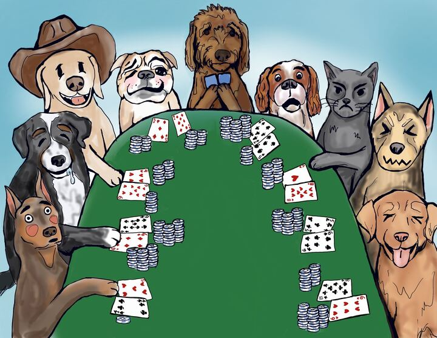

This puzzle has an image of animals playing poker shown below.

Based on the faces of the animals we should be able to figure out the cards the dog in the center is holding.
We will go from left to right to figure this out.
# Animal 1
The dog on the left is holding a ♥️5 and ♣️4.
This is 9 high with a suit of ♥️.
It is making this face 😳.
It bet 1 chip.
Could be good or bad.
# Animal 2
This dog is holding a ♠️9 and ♦️6.
This is 17 high with a suit of ♦️.
It is making this face 🤤.
I think it is pretty happy.
